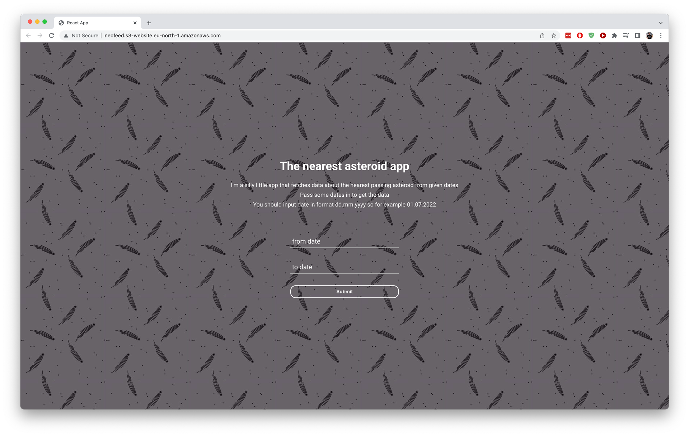

# NEOFeed App

This is a small demo project that fetches near earth objects from Nasa API.

You can read more about **Neo - Feed** API and other great APIs Nasa provides from [https://api.nasa.gov/](https://api.nasa.gov/). Just click **Browse APIs** and search Neo - Feed.

Deployed version of this demo can be found [here](http://neofeed.s3-website.eu-north-1.amazonaws.com/).



---

## Getting started

To run this project locally you should first generate API key [here](https://api.nasa.gov/#signUp).

After getting your api key you should create a .env file with

```
$ touch .env
```

and add your newly created key there like this

```
REACT_APP_API_KEY=YOUR-APIKEY-HERE
```

---

## TODOs list

- Find correct date regex. Currencly input accepts dates like 31.02.2022

- Add abort to fetch. Getting data from api is currently kind of hacky and tedious. One could for example search several months time period of data and wait a loooong time the fetching to finish.

- Displayed search result is kind of dull and definetely could be polished to look prettier.

- Write tests to at least ensure sorting logic of the data and that utils functions work accordingly

---

This project was bootstrapped with [Create React App](https://github.com/facebook/create-react-app).
